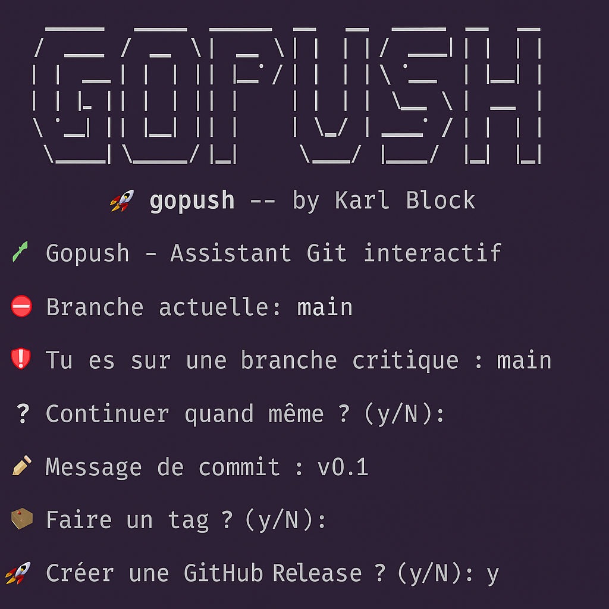

# 🚀 gopush

gopush — Git sans prise de tête.
Un assistant Git interactif pour gérer commits, branches, tags et releases en toute simplicité, depuis le terminal.

``` 
          _ __                   __  
   ____ _(_) /_____  __  _______/ /_ 
  / __ `/ / __/ __ \/ / / / ___/ __ \
 / /_/ / / /_/ /_/ / /_/ (__  ) / / /
 \__, /_/\__/ .___/\__,_/____/_/ /_/ 
/____/     /_/ 
```

[](https://bash.sh)
[](LICENSE)
[](https://github.com/Karlblock)
[](https://github.com/Karlblock/gopush/releases)

---

## 🎥 Démo



---

## ✨ Fonctionnalités

- ✅ Prompt interactif étape par étape
- 🔄 Option `git pull --rebase`
- 🏷️ Tag automatique ou personnalisé
- 📄 Mise à jour auto de `CHANGELOG.md`
- 🚀 Création de release GitHub (`gh`)
- 🌐 Ouverture automatique du dépôt GitHub
- 🛡️ Confirmation en cas de push sur `main`
- 🧠 Système de branches pro : `dev`, `feat/*`, `fix/*`

---

## ⚙️ Installation

```bash
curl -sSL https://raw.githubusercontent.com/Karlblock/gopush/main/install.sh | bash
```

---

## 🚀 Utilisation

```bash
gopush
```

Et suis les étapes dans ton terminal 🤖

---

## 🧩 Bonus inclus

- `gomerge.sh` : fusion interactive `feat/*` → `dev` / `dev` → `main`
- `install.sh` : installation et alias auto
- `docs/` : page GitHub Pages du projet

---

## 📬 Contribuer

Les contributions sont les bienvenues ! 🙌

Que vous souhaitiez :

- 🛠️ corriger un bug,
- ✨ proposer une fonctionnalité,
- ⚙️ intégrer une CI/CD (GitHub Actions, tests, releases...),
- 🧪 améliorer l’expérience utilisateur ou l’interactivité,

👉 Créez une **issue** pour en discuter, ou soumettez directement une **pull request**.

Merci de contribuer à faire de `gopush` un outil plus utile pour tous ! 💚

---

## ☕ Buy me a coffee

If you like my work and want to support its development:

[](https://www.buymeacoffee.com/karlblock)

---

## 📄 Licence

Distribué sous licence MIT © [KarlBlock](https://github.com/Karlblock)
