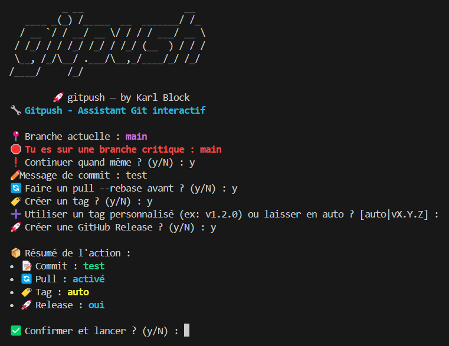

# 🚀 gitpush

```
          _ __                   __  
   ____ _(_) /_____  __  _______/ /_ 
  / __ `/ / __/ __ \/ / / / ___/ __ \
 / /_/ / / /_/ /_/ / /_/ (__  ) / / /
 \__, /_/\__/ .___/\__,_/____/_/ /_/ 
/____/     /_/                       

     🚀 gitpush — by Karl Block
```

[](https://bash.sh)
[](LICENSE)
[](https://github.com/Karlblock)
[](https://github.com/Karlblock/gitpush/releases)

---

## 🧨 Pourquoi `gitpush` ?

> Arrêtons le danger du classique :  
> `git add . && git commit -m "" && git push`

Combien de fois on a poussé un commit à l’arrache ?  
Message vide, ajout de fichiers qu’on n’a pas vérifié, et push direct ? 😵

**`gitpush`** est un outil CLI simple qui :
- 🚫 T’empêche de pousser sans réfléchir
- ✍️ Te génère un message de commit (ou t’en propose un)
- 🧠 Te montre ce que tu vas envoyer avant de valider
- 🚀 Et pousse ton code en douceur

> 🧠 Objectif : rendre Git agréable, lisible, et moins dangereux.


## 🎥 Démo


=======
# 🚀 gitpush — Assistant Git interactif


> Un assistant Git en CLI pour des commits propres, interactifs et sans stress.

---

## 📦 Pourquoi `gitpush` ?

Combien de fois tu as fait :

```bash
git add . && git commit -m "" && git push
```

...sans vraiment checker ce que tu faisais ? 😬

➡️ `gitpush` est un outil CLI fun et pratique pour :
- ✅ Avoir un status clair de la branche
- 🧠 Éviter les pushs sur `main` par erreur
- ✍️ Forcer un message de commit utile
- 🚀 Automatiser le tag, le changelog, la release


---

## 🛠️ Fonctionnalités

| Fonction                  | Description |
|--------------------------|-------------|
| `gitpush`                | Lance l’assistant interactif |
| `--version`              | Affiche la version actuelle |
| `--help`                 | Montre l’aide CLI |
| `--simulate`             | Affiche les actions sans les exécuter |
| `--yes`                  | Confirme automatiquement toutes les actions |
| Évite push sur `main`    | Propose de changer/créer une branche |
| Génère un `CHANGELOG.md`| Inclus automatiquement les commits |
| Tag automatique          | Basé sur le dernier tag ou perso |
| GitHub Release (via `gh`)| Crée une release avec tag |

---

## 📸 Aperçu


---

## 🛠️ Installation

### 1. Utilisation rapide avec `install.sh`

```bash
<<<<<<< HEAD
curl -o gitpush https://raw.githubusercontent.com/Karlblock/gitpush/main/gitpush.sh
chmod +x gitpush
sudo mv gitpush /usr/local/bin/gitpush
```

---

## 🚀 Utilisation

```bash
gitpush
```

Et suis les étapes dans ton terminal 🤖

---

## 🧩 Bonus inclus

- `gomerge.sh` : fusion interactive `feat/*` → `dev` / `dev` → `main`
- `install.sh` : installation et alias auto
- `docs/` : page GitHub Pages du projet

---

## 📬 Contribuer

Les contributions sont les bienvenues ! 🙌

Que vous souhaitiez :

- 🛠️ corriger un bug,
- ✨ proposer une fonctionnalité,
- ⚙️ intégrer une CI/CD (GitHub Actions, tests, releases...),
- 🧪 améliorer l’expérience utilisateur ou l’interactivité,

👉 Créez une **issue** pour en discuter, ou soumettez directement une **pull request**.

Merci de contribuer à faire de `gitpush` un outil plus utile pour tous ! 💚

---

## ☕ Buy me a coffee

If you like my work and want to support its development:

[](https://www.buymeacoffee.com/karlblock)
=======
curl -sSL https://raw.githubusercontent.com/Karlblock/gitpush/main/install.sh | bash
```

### 2. Avec `make`

```bash
git clone https://github.com/Karlblock/gitpush.git
cd gitpush
make install
```

---

## 🧪 Simuler sans rien casser

```bash
gitpush --simulate
```

Tu verras exactement ce que l’outil ferait, sans modification réelle 🕵️‍♂️

---

## 📋 Exemple complet

```bash
$ gitpush
📍 Branche actuelle : dev
✏️ Message de commit : fix: amélioration script
🏷️ Créer un tag : oui (auto)
🚀 Release GitHub : oui
```

---

## 🔧 Désinstallation

```bash
make uninstall
```

---

## ☕ Contribuer

- PR bienvenues !
- [Buy Me a Coffee](https://www.buymeacoffee.com/karlblock)


---

## 📄 Licence

Distribué sous licence MIT © [Karl Block](https://github.com/Karlblock)
=======

